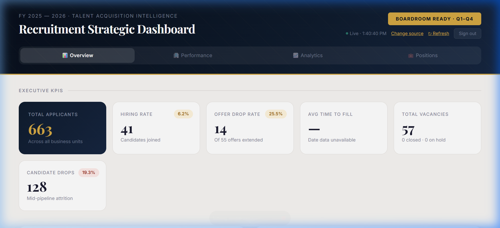

<div align="center">

# 📊 Recruitment Strategic Dashboard

### Talent Acquisition Intelligence · FY 2025–26

A **boardroom-ready**, real-time recruitment analytics dashboard that transforms raw Google Sheets data into executive-grade hiring intelligence.

[](https://test-hr-dash.netlify.app)
[](https://test-hr-dash.netlify.app)
[](./LICENSE)
[](https://www.typescriptlang.org/)
[](https://react.dev)
[](https://vite.dev)

---



<br/>

> **Live at → [test-hr-dash.netlify.app](https://test-hr-dash.netlify.app)**
>
> _Confidential · Internal Access Only · Auto-refreshes every 5 minutes_

</div>

---

## ✨ Why This Dashboard?

Most recruitment reports are static spreadsheets passed around in email. This dashboard **replaces them** with a live, interactive, always-current analytics surface that leadership can open in any browser — no installs, no training, no stale data.

| Pain Point | How We Solve It |
|---|---|
| 📋 Manual Excel reports every week | ⚡ Live data — auto-pulls from Google Sheets |
| 🔍 No pipeline visibility | 🎯 Full funnel: Applied → Shortlisted → Interviewed → Offered → Joined |
| 📊 Hard to compare sources/BUs | 📈 Side-by-side efficiency metrics with color-coded performance |
| ⏱️ Unknown time-to-fill | 🕐 Auto-calculated from application → joining dates |
| 🔒 Data shared insecurely | 🔐 SHA-256 credential gating, session-based auth |

---

## 🎯 Features at a Glance

<table>
<tr>
<td width="50%">

### 📊 Overview Tab
- **Executive KPI Strip** — Total Applicants, Hiring Rate, Offer Acceptance, Avg Time to Fill, Vacancies, Candidate Drops
- **Pipeline Funnel** — Visual stage-by-stage conversion with drop-off percentages
- **Source Channel Efficiency** — Which recruitment channels deliver the best joining rates
- **Auto-generated Insights** — AI-style key insight cards highlighting ROI gaps

</td>
<td width="50%">

### 🏢 Performance Tab
- **Business Unit Performance** — Per-BU applicant volume, joining rate, and time-to-fill
- **Pipeline Leakage Points** — Candidate drops, R1/R2 rejects, no-shows, offer drops
- **Vacancy Tracker** — Total / Filled / On Hold / In Process with fill-rate progress bar
- **Top BU Fill Status** — Quick-glance high/partial/low fill indicators

</td>
</tr>
<tr>
<td width="50%">

### 📈 Analytics Tab
- **Quarterly Trend Chart** — Chart.js bar chart: Applicants vs. Joined across Q1–Q4
- **Recruiter Performance Matrix** — Per-recruiter stats with Lead/Mid/Needs Support badges
- **Top Rejection Reasons** — Ranked list of why candidates are rejected
- **Offer Decline Reasons** — Why candidates drop offers after receiving them

</td>
<td width="50%">

### 💼 Positions Tab
- **Top 14 Positions by Volume** — Dual-column ranked view of pipeline flow per role
- **Application-to-Join Bars** — Mini inline bars with color-coded success rates

### 📖 Glossary Tab
- **KPI Definitions & Formulas** — Every metric explained with its exact calculation
- **Hover-interactive Cards** — Clean card layout with formula notation

</td>
</tr>
</table>

---

## 🏗️ Architecture

```mermaid
graph LR
    A[("📝 Google Sheets<br/>(Published as CSV)")] -->|HTTP GET| B["⚡ Netlify Function<br/><code>dashboard-data.ts</code>"]
    B -->|Parse CSV<br/>Compute KPIs| C["📊 JSON Response"]
    C -->|fetch()| D["⚛️ React Dashboard<br/><code>index.tsx</code>"]
    D -->|Chart.js| E["📈 Interactive Charts"]
    D -->|CSS Variables| F["🎨 Boardroom UI"]

    style A fill:#FEF3DC,stroke:#D4A843,color:#542208
    style B fill:#162640,stroke:#D4A843,color:#FFFFFF
    style C fill:#EFF6F4,stroke:#2E8070,color:#0D4840
    style D fill:#FAF6F1,stroke:#C8BDB3,color:#1A1A2E
    style E fill:#EFF6F4,stroke:#2E8070,color:#0D4840
    style F fill:#FEF3DC,stroke:#D4A843,color:#542208
```

### Data Flow in Detail

1. **🔐 Authentication** — User signs in via SHA-256 hashed credential check (no plaintext storage)
2. **⚙️ Configuration** — A dialog lets users confirm or override the default Google Sheets CSV URLs
3. **📡 Server-side Fetch** — The Netlify function fetches both CSVs server-side, bypassing CORS restrictions
4. **🔄 CSV Parsing** — A custom parser handles quoted fields, varied delimiters, and edge cases
5. **🧮 Metric Computation** — All KPIs, funnels, aggregations, and trends are computed server-side in [`kpi-config.ts`](netlify/functions/kpi-config.ts)
6. **📦 JSON Response** — A single structured JSON payload is returned (cached for 5 min)
7. **🎨 Client Render** — React renders the full dashboard with Chart.js visualizations
8. **🔄 Auto-refresh** — The client re-fetches data every 5 minutes automatically

---

## 💻 Tech Stack

| Layer | Technology | Purpose |
|:---:|:---|:---|
| **Framework** | [TanStack Start](https://tanstack.com/start) + React 19 | File-based routing, SSR-ready React framework |
| **Router** | [TanStack Router](https://tanstack.com/router) v1 | Type-safe, file-based routing |
| **Bundler** | [Vite](https://vite.dev) 7 | Lightning-fast HMR and optimized production builds |
| **Styling** | [Tailwind CSS](https://tailwindcss.com) v4 + CSS Custom Properties | Utility layer + curated design tokens |
| **Charts** | [Chart.js](https://www.chartjs.org/) via `react-chartjs-2` | Responsive bar charts for quarterly trends |
| **Icons** | [Lucide React](https://lucide.dev) | Clean, consistent icon set |
| **Backend** | [Netlify Functions](https://www.netlify.com/products/functions/) | Serverless CSV fetch, parse, and compute |
| **Language** | TypeScript 5.9 (strict mode) | End-to-end type safety |
| **Deployment** | [Netlify](https://www.netlify.com/) | CI/CD, CDN, serverless functions |

---

## 🎨 Design System

The dashboard uses a **custom curated palette** designed for executive presentations — no generic Bootstrap or Tailwind defaults.

```
NAVY (Corporate Base)          GOLD (Accent)             TEAL (Success)           BRICK (Alert)
━━━━━━━━━━━━━━━━━━━           ━━━━━━━━━━━━━━            ━━━━━━━━━━━━━            ━━━━━━━━━━━━━
#070E1A ██ navy-900            #D4A843 ██ gold           #2E8070 ██ teal-400      #C04A38 ██ brick-400
#0F1B2D ██ navy-800            #F5E6CC ██ gold-light     #1A6158 ██ teal-500      #9A3022 ██ brick-500
#162640 ██ navy-700            #B8922E ██ gold-dark      #0D4840 ██ teal-600      #731B12 ██ brick-600
```

| Element | Choice | Rationale |
|:---|:---|:---|
| **Headers** | Playfair Display (serif) | Conveys authority and boardroom gravitas |
| **Body / Data** | Inter (sans-serif) | Optimized for screen readability at small sizes |
| **Panels** | Glassmorphism (`backdrop-filter: blur`) | Modern, layered depth without visual clutter |
| **Interactions** | `translateY` hover lifts, `tabFadeIn` transitions | Subtle motion that feels responsive and premium |
| **Indicators** | Teal / Amber / Brick color-coding | Instant pass/warn/fail comprehension |

---

## 🚀 Getting Started

### Prerequisites

- **Node.js** v18+ (v20 recommended)
- **npm** (bundled with Node) or **pnpm**
- Optionally: [Netlify CLI](https://docs.netlify.com/cli/get-started/) for local function testing

### Installation

```bash
# Clone the repository
git clone https://github.com/senarkit/HR-Dashboard.git
cd HR-Dashboard

# Install dependencies
npm install
```

### Development

```bash
# Start Vite dev server (frontend only, port 3000)
npm run dev

# Or use Netlify CLI for full-stack local development (recommended)
# This proxies the serverless function at /.netlify/functions/dashboard-data
netlify dev
```

| Mode | URL | Functions? |
|:---|:---|:---:|
| `npm run dev` | `http://localhost:3000` | ❌ |
| `netlify dev` | `http://localhost:8888` | ✅ |

### Production Build

```bash
npm run build
```

Outputs optimized bundles to `dist/client` (configured in [`netlify.toml`](netlify.toml)).

---

## 📂 Project Structure

```
HR-Dashboard/
│
├── 📁 public/                          # Static assets
│   ├── dashboard_preview.png           # README screenshot
│   ├── dashboard_walkthrough.webp      # Walkthrough recording
│   ├── recruitment_dashboard.html      # Design reference (static HTML)
│   └── favicon.ico
│
├── 📁 src/                             # Client application
│   ├── 📁 routes/
│   │   ├── __root.tsx                  # Root layout — Google Fonts, meta tags
│   │   └── index.tsx                   # 🎯 Main dashboard (1,091 lines)
│   │                                   #    ├── LoginScreen — SHA-256 auth
│   │                                   #    ├── ConfigDialog — CSV URL config
│   │                                   #    ├── OverviewTab — KPIs + Funnel + Source
│   │                                   #    ├── PerformanceTab — BU + Leakage + Vacancy
│   │                                   #    ├── AnalyticsTab — Trends + Recruiter Matrix
│   │                                   #    ├── PositionsTab — Top positions by volume
│   │                                   #    └── GlossaryTab — KPI definitions
│   ├── router.tsx                      # TanStack Router setup
│   ├── routeTree.gen.ts                # Auto-generated route tree
│   └── styles.css                      # 🎨 Design system (228 lines)
│                                       #    ├── CSS custom properties (50+ tokens)
│                                       #    ├── Glass panel styles
│                                       #    ├── Animations (fadeIn, shake, spin, pulse)
│                                       #    └── Interactive states (hover, focus)
│
├── 📁 netlify/functions/               # Serverless backend
│   ├── dashboard-data.ts               # 📡 CSV fetch + parse + compute (507 lines)
│   │                                   #    ├── parseCSV() — RFC-compliant CSV parser
│   │                                   #    ├── computeDashboard() — All metric logic
│   │                                   #    └── handler() — Netlify function entry point
│   └── kpi-config.ts                   # 📋 KPI formula book (314 lines)
│                                       #    ├── STATUS_PATTERNS — Regex classifications
│                                       #    ├── COLUMN_CANDIDATES — Adaptive header mapping
│                                       #    ├── KPI_FORMULAS — Named formulas with docs
│                                       #    ├── FY_QUARTERS — Indian FY quarter mapping
│                                       #    └── THRESHOLDS — Color-coding breakpoints
│
├── vite.config.ts                      # Vite + TanStack + Tailwind + Netlify plugins
├── tsconfig.json                       # TypeScript strict config, @/* path alias
├── netlify.toml                        # Build & dev server configuration
├── package.json                        # Dependencies and scripts
└── LICENSE                             # MIT License (Arkit Sen, 2026)
```

---

## 📊 Data Source Configuration

The dashboard consumes **two Google Sheets** published as CSV:

| Sheet | Contains | Key Columns |
|:---|:---|:---|
| **Applicants** | Candidate pipeline data | Status, Source, Business Unit, Position, Recruiter, Application Date, Joining Date, Quarter |
| **Vacancies** | Open positions tracker | Status, Business Unit |

### 🔌 Adaptive Column Detection

The CSV parser uses a **fuzzy column matching** strategy — it doesn't require exact header names. For each field, it tries multiple candidates in priority order:

```
"Business Unit" → tries: business unit, bu, company, division, department, entity
"Status"        → tries: status, current status, stage, pipeline stage, recruitment status
"Source"        → tries: source, source channel, channel, source of application
```

This means the dashboard works with varied Google Sheet formats without code changes.

### 📋 Status Classification Pipeline

Candidates are classified using a **priority-ordered regex pipeline** — first match wins:

```
Joined → Offer Drop → Offer → Dropped → R1 Reject → R2 Reject → No-Show → Screen Reject → Shortlisted
```

### 📅 Quarter Derivation (Indian Financial Year)

```
Q1: April – June       Q2: July – September
Q3: October – December  Q4: January – March
```

Falls back gracefully: explicit "Quarter" column → date parsing → default Q1.

---

## 🔐 Security

- **No plaintext credentials** — Username and password are stored as SHA-256 hex digests only
- **Session-based auth** — `sessionStorage` flag; cleared on tab close
- **Server-side data fetching** — CSV URLs are never exposed to the browser network tab
- **CORS bypass** — All Google Sheets requests go through the Netlify function proxy
- **Confidential footer** — Visible "Internal Distribution Only" marking

---

## 📐 KPI Formula Reference

| KPI | Formula | Unit |
|:---|:---|:---:|
| **Hiring Rate** | `Joined ÷ Total Applicants × 100` | % |
| **Offers Extended** | Count of candidates reaching offer stage | count |
| **Offer Acceptance Rate** | `Joined ÷ Offers Extended × 100` | % |
| **Offer Drop Rate** | `Offer Drops ÷ Offers Extended × 100` | % |
| **Fill Rate** | `Filled Vacancies ÷ Total Vacancies × 100` | % |
| **Avg Time to Fill** | `mean(Joining Date − Application Date)` for joined candidates | days |
| **Candidate Drops** | Count of mid-pipeline withdrawals (not at offer stage) | count |
| **Screen Rejects** | Count of candidates rejected before interview | count |

> All formulas are defined in [`kpi-config.ts`](netlify/functions/kpi-config.ts) with plain-English documentation and can be modified without touching the dashboard UI.

---

## 🛠️ Development Commands

| Command | Description |
|:---|:---|
| `npm run dev` | Start Vite dev server on port 3000 |
| `npm run build` | Production build → `dist/client` |
| `netlify dev` | Full-stack local dev (functions + frontend) on port 8888 |

---

## 📄 License

This project is licensed under the **MIT License** — see the [LICENSE](./LICENSE) file for details.

<div align="center">

---

**Built with ❤️ by [Arkit Sen](https://github.com/senarkit)**

*Talent Acquisition Intelligence · FY 2025–26 · Boardroom Ready*

</div>
